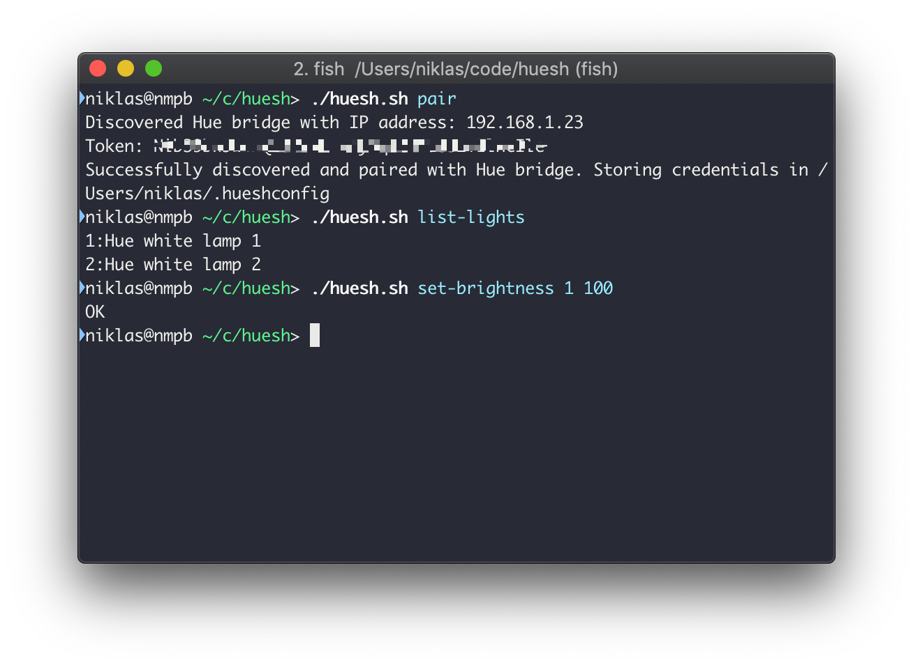

# huesh

A shell script for controlling Hue lights.

## Usage
First you need to push button on the Hue bridge, then run `huesh.sh pair` and you're good to go. Credentials are stored on disk so you only need to run `pair` once.

Find out id:s of your lights by running `huesh.sh list-lights` and then for example change brightness by running `huesh.sh set-brightness 1 100` where 1 is the id of the light and 100 is the desired brightness.



## Help text
```
Usage: huesh.sh <command> [<args>]

Tool for controlling Hue lights.

EXAMPLES:
    huesh.sh pair # Pair with Hue bridge
    huesh.sh list-lights # List all lights in your Hue system
    huesh.sh set-brightness 1 100 # Set brightness level for light with id 1

COMMANDS:
    help             Prints these usage instructions.
    pair             Pair with a Hue bridge on the same network. Note that you must push the button on Hue bridge before pairing.
    list-lights      List all Lights in your Hue system.
    list-scenes      List all scenes in your Hue system.
    set-hsl          Set hue, saturation and brightness for a specific light.
    set-hue          Set hue for a specific light.
    set-saturation   Set saturation for a specific light.
    set-brightness   Set brightness for a specific light.
```

## TODO
* Improve help - individual help text per command (e.g. `huesh.sh help set-hsl`)
* Improve help - print command's expected arguments when supplying invalid arguments.
* Make more portable by removing Python dependency etc

Pull requests are welcome!
